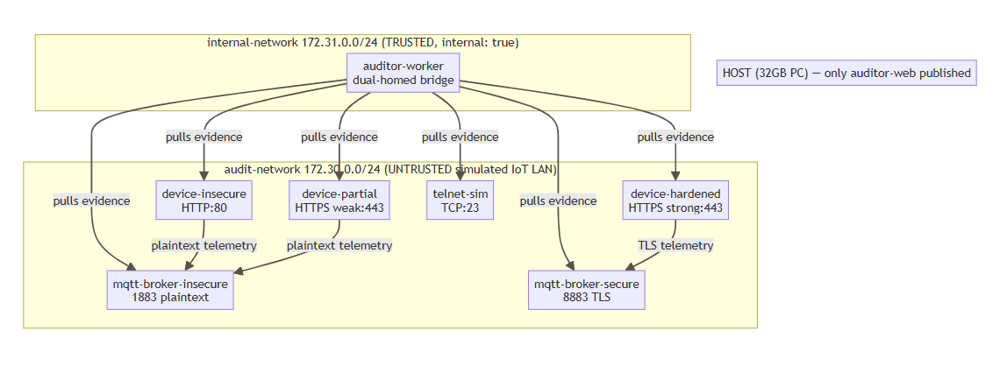
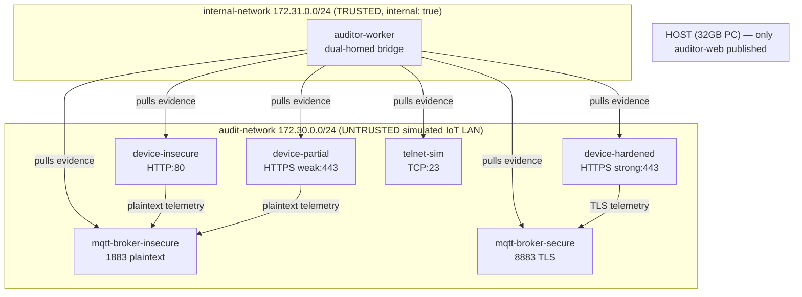

# Lab Architecture — Phases 0-5

Rendered image above; Mermaid source below (also renders automatically on GitHub).

## Containers (Phases 0-5 scope)

| Container | Network(s) | Port | Host-exposed? |
|---|---|---|---|
| device-insecure | audit-network | 80 (HTTP) | no |
| device-partial | audit-network | 443 (weak TLS) | no |
| device-hardened | audit-network | 443 (strong TLS) | no |
| telnet-sim | audit-network | 23 | no |
| mqtt-broker-insecure | audit-network | 1883 | no |
| mqtt-broker-secure | audit-network | 8883 | no |
| auditor-worker | audit-network + internal-network | n/a (toolbox) | no |

`auditor-api`/`auditor-database`/`document-store`(as a service)/`auditor-web` are added in the Phase 6-8 follow-up plan; `document-store` is a plain filesystem directory for Phases 0-5.
