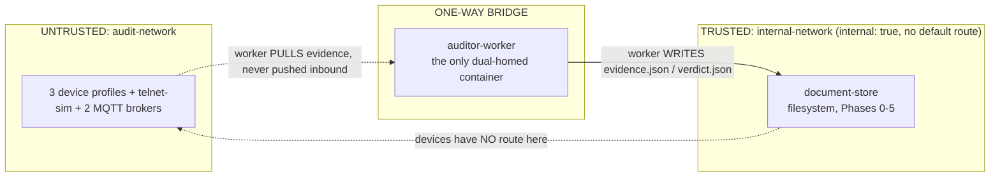

# Trust Boundaries — Phases 0-5

## Rules enforced

1. Devices cannot reach `internal-network` at all — it is a Docker `internal: true` network with no
   gateway to anything devices are attached to.
2. `auditor-worker` never accepts inbound connections from devices; it only initiates outbound
   probes (nmap/curl/mosquitto_sub/openssl) against them.
3. Only `auditor-worker`'s own filesystem writes reach `document-store` — devices cannot write
   evidence, only be evidence *about*.
4. No device port is published to the PC host — the only host-facing service in the full platform
   (Phase 6-8) is `auditor-web`.
